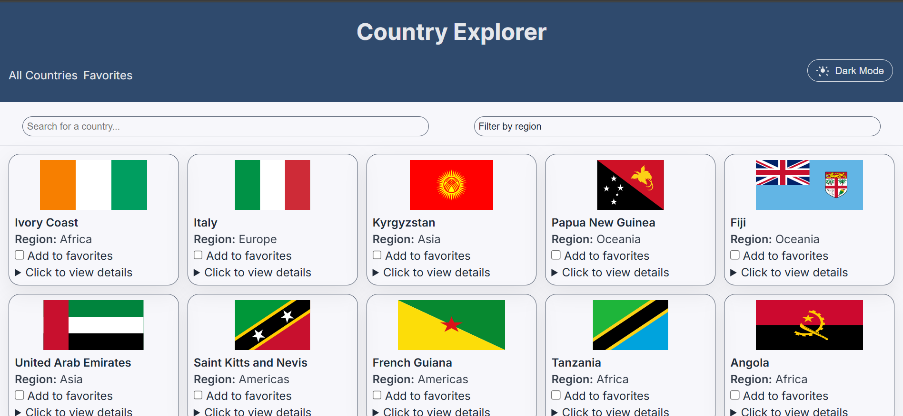
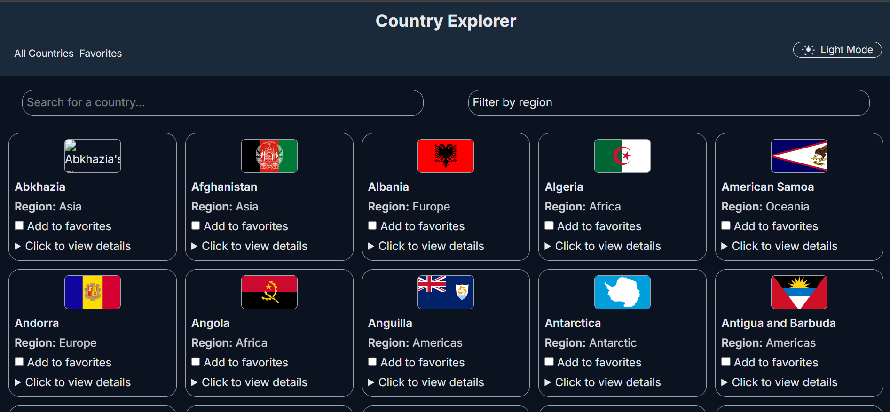
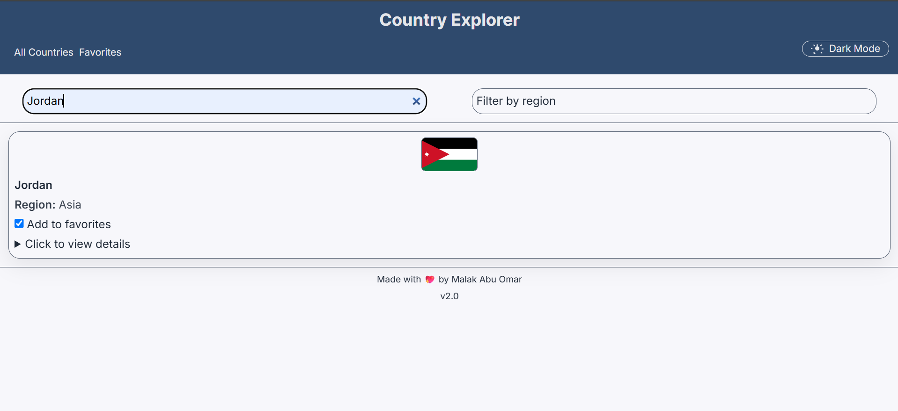
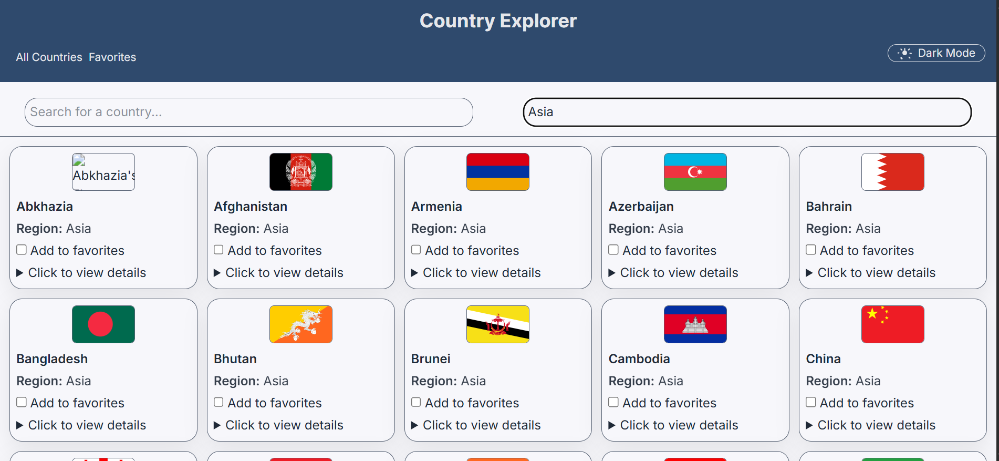
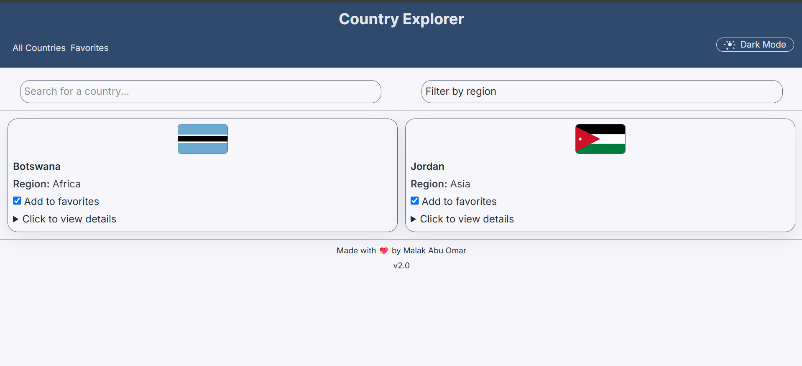

# 🗺️ Country Explorer (Vanilla JavaScript + TypeScript)
A Front-end web application built with HTML, CSS, JavaScript, and TypeScript. The application displays countries from all around the world, enables searching for a country, filters countries by region, and saves countries to favorites.

## ✅ Features
- 🛜 Fetches and displays countries from the Rest Countries API.
- ℹ️ Displays detailed information for each country.
- 🔍 Search for countries by name.
- 🌍 Filter countries by region.
- ⭐ Add/remove countries to favorites (local storage).
- ☀️ Enable light and dark modes.
- 📱 Responsive design techniques, to adapt to different screen sizes.

## ⚙️ Technologies:
- HTML5
- CSS3
- JavaScript (ES6+)
- TypeScript
- Local Storage
- REST Countries API

## 🚀 How to Run
1. Clone the repository:
   ```bash
   git clone https://github.com/malakmuayad11/CountryExplorer.git
2. Compile TypeScript: ```bash
npx tsc
3. Open index.html in your browser

## 📸 Screenshots

### 🏠 Home Screen


### 🌙 Dark Mode


### 🔍 Search


### 🌍 Filter


### ⭐ Favorites


## 👩‍💻 Author
**Malak Muayad**  
📧 [malakmuayad15@gmail.com](mailto:malakmuayad15@gmail.com)  
🔗 [malakmuayad11](https://github.com/malakmuayad11)
